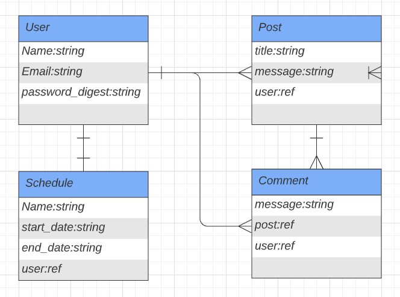

# FastingHelper <!-- omit in toc -->

> This app is a fasting calculator app. Where you can both post stories and make groups to connect with people to help you. It will give you both information on different styles of fasting as well as timers to help you keep on track. This app's goal will be to be a type of clone of Insight Timer, but for fasting instead. My goal is to both copy and implement as much functionality and design as I can from Insight Timer.

- [MVP](#mvp)
  - [Goals](#goals)
  - [Libraries and Dependencies](#libraries-and-dependencies)
  - [Client (Front End)](#client-front-end)
    - [Wireframes](#wireframes)
    - [Component Hierarchy](#component-hierarchy)
    - [Time Estimates](#time-estimates)
  - [Server (Back End)](#server-back-end)
    - [ERD Model](#erd-model)
- [Post-MVP](#post-mvp)
- [Code Showcase](#code-showcase)
- [Code Issues & Resolutions](#code-issues--resolutions)

 

 

## MVP

> These are my minimum requirements.

- Make a full CRUD app
- Make full CRUD backend with Ruby on Rails
- Have timers for different fasting schedules
- Allow users to post stories and have comments on them
- Allow users to join groups and dm each other
- Allow users to post events they may be hosting
- Users can post informational guides or help
- App tracks users progress and they can set goals for themselves

 

### Libraries and Dependencies

> This project will be a React frontend, Ruby on Rails backend

|    Library    | Description                            |
| :-----------: | :------------------------------------- |
|     React     | A javascript library                   |
| React Router  | A router package to be used with react |
|  Tails Winds  | A styling package                      |
| Ruby on Rails | Backend library for SQL database       |

 

### Client (Front End)

#### Wireframes

> This app will be mostly for mobile use.

#### Component Hierarchy

## Time Estimates

| Task                             | Priority | Estimated Time | Time Invested | Actual Time |
| -------------------------------- | :------: | :------------: | :-----------: | :---------: |
| Create Rails app                 |    L     |     .5 hrs     |     2 hrs     |    3 hrs    |
| Scaffold models and tables       |    H     |     3 hrs      |     1 hrs     |     TBD     |
| Add routes and model relations   |    H     |     2 hrs      |     1 hrs     |     TBD     |
| Testing in postman               |    H     |     2 hrs      |     1 hrs     |     TBD     |
| Deploy to heroku                 |    H     |    1.5 hrs     |     1 hrs     |     TBD     |
| Create React app                 |    H     |     2 hrs      |     1 hrs     |     TBD     |
| Create file structure            |    H     |    2.5 hrs     |     1 hrs     |     TBD     |
| create some UI                   |    H     |    1.5 hrs     |     1 hrs     |     TBD     |
| create api files                 |    H     |     2 hrs      |     1 hrs     |     TBD     |
| create container and user data   |    H     |     5 hrs      |     1 hrs     |     TBD     |
| Create forms                     |    H     |    2.5 hrs     |     1 hrs     |     TBD     |
| React routing to different pages |    H     |     2 hrs      |     1 hrs     |     TBD     |
| Create profile and stories       |    H     |     5 hrs      |     1 hrs     |     TBD     |
| Deploy and style                 |    H     |     8 hrs      |     1 hrs     |     TBD     |
| TOTAL                            |          |     40 hrs     |     3 hrs     |     TBD     |

 

### Server (Back End)

#### ERD Model

---

## Post-MVP

- Adding more to the discover and learn page
- Adding so people can do file upload for images

---

## Code Showcase

> Use this section to include a brief code snippet of functionality that you are proud of and a brief description.

## Code Issues & Resolutions

> Use this section to list of all major issues encountered and their resolution.
